# 

# 51单片机

intel开发的8051单片机内核，

STC89C52单片机

- 所属系列：51单片机系列

- 公司：STC公司

- 位数：8位

-	IRAM:512字节

-	ROM: 8K （Flash）

- 工作频率：12MHz（本开发板使用）

在电路原理图中，VCC代表电源正极

GND代表电源的负极

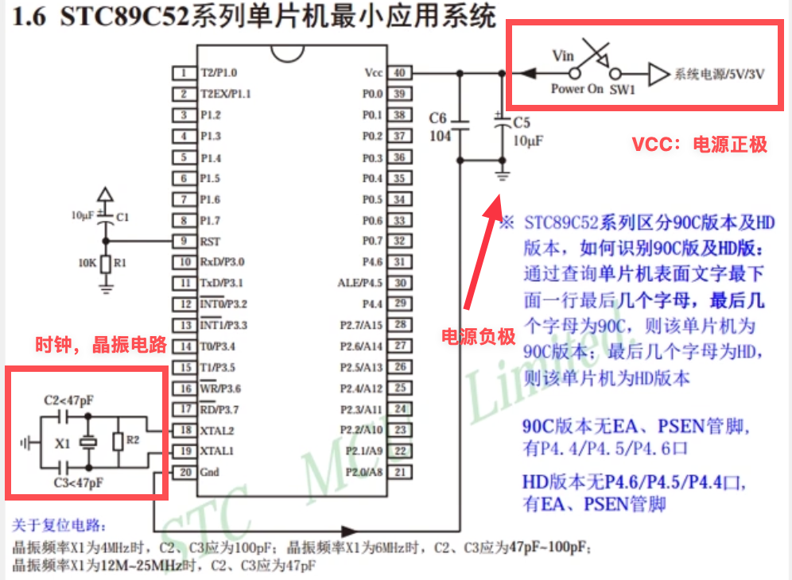

复位电路，即程序代码执行到某一条以后想要重新重头开始执行，就需要外部接一个复位电路。

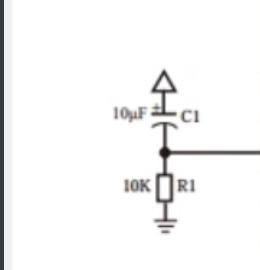

注意，在单片机的设计图中有一个圆形缺口的位置，这代表了单片机的正反面

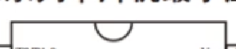

在拆卸单片机时，要注意正面（缺口）面朝上，并且正向摆放，防止正负电极反向，导致短路

51单片机有4个8位的I/O口，对应的控制寄存器为：

| 寄存器 | 控制端口  | 功能说明           |
| ------ | --------- | ------------------ |
| **P0** | P0.0-P0.7 | 控制端口0的8个引脚 |
| **P1** | P1.0-P1.7 | 控制端口1的8个引脚 |
| **P2** | P2.0-P2.7 | 控制端口2的8个引脚 |
| **P3** | P3.0-P3.7 | 控制端口3的8个引脚 |


## 点亮LED

LED 引脚未修建时  长脚为正极 短脚为负极


电路板上 电阻的读数方式

例如 102 = 10 + 00 == 1000

473  = 47 + 000 == 47000

即最后一位表示倍率，47n 表示47*10^n^

于是对于LED灯的点亮就变成了如何控制对应的接口输出高电平还是低电平

例如当P20接口输出低电平时，形成电流通过D1就会点亮D1，如果P20输出高电平就会有两边正极，不会形成电流，D1不亮。

在电路中对于高电平5V，低电平0V的电路，定义为TTL电平

通过编写程序，CPU解析程序代码以后发出信号，到驱动器中，驱动硬件电路形成高低电平。

通过电路图我们可以看到，与LED相连的引脚为P2.0 即通过P2寄存器来控制输出高低电平。

例如我们想点亮P20线路上的LED灯，那么就需要输出11111110 转换为16进制为0xFE


我们通过KeilProject编译器编译以后，在选择单片机类型以后可以右键插入头文件，该头文件根据选择的单片机型号不同而改变，并且要在项目设置中，点击output，然后输出.hex文件

**.hex文件是 Intel HEX 格式的文件**，是一种文本格式的十六进制文件，用于存储单片机的机器代码和程序数据。

然后通过开发版的烧录工具，烧录到开发板中。

```c++
#include <REGX52.H>

void main()
{
	P2=0xFE;
  while(1){}
}
```

对于单片机而言，由于里面通常只运行一个程序，因此会不断地循环执行该程序，不断地删除然后创建一个进程，所消耗的资源较大，因此我们可以让程序一直运行，从而减少消耗

LED灯闪烁

由于CPU频率有12Mhz，而如果我们只是单纯的切换P2的内容，只会使得LED闪烁过快，而人眼无法分辨，因此我们需要给LED灯添加延时

通过开发板给的软件，我们可以获取到对应的计算延时代码

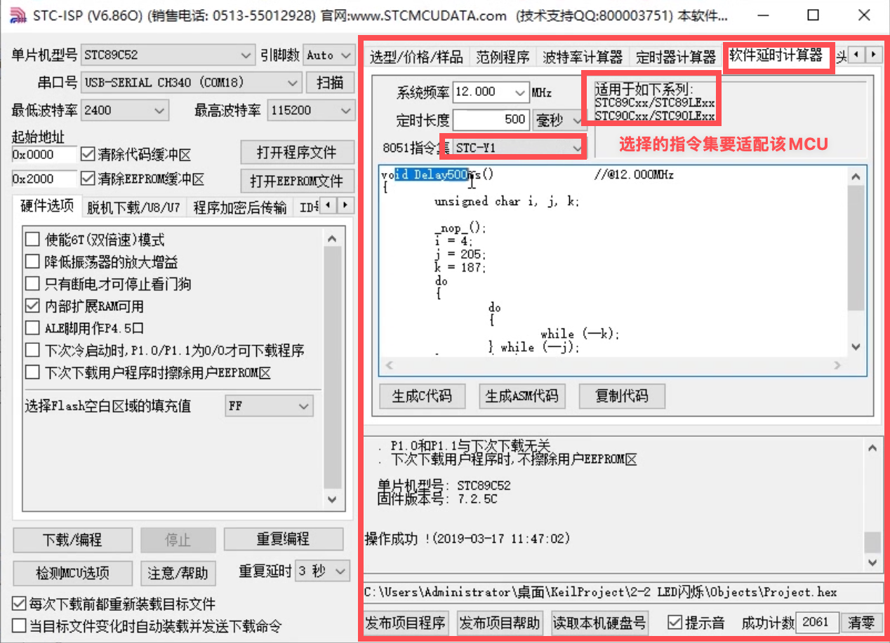

# STM32单片机

## GPIO

- （General Purpose Input Output) 通用输入输出口

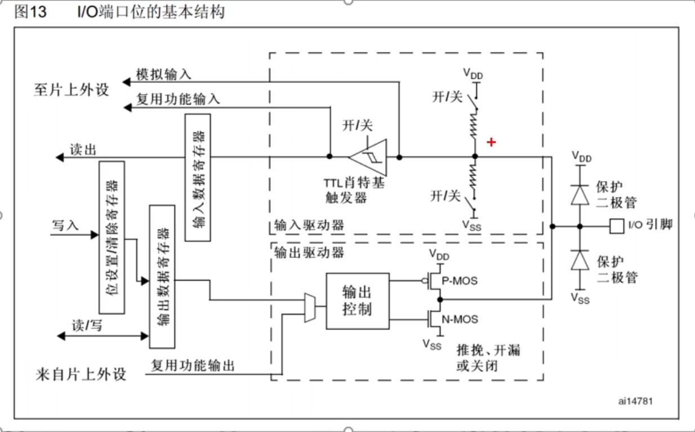

上拉电阻与下拉电阻，当引脚悬空时（没有外部输入），开发板非常容易受到外界的干扰，此时需要加入上拉或者下拉电阻。当Vdd接通时，表示默认高电平，当Vss接通时默认为低电平。


施密特触发器（图中为肖特基触发器，图片错误），这里的触发器保证了不会因为输入信号的失真导致信号出现错误。施密特触发器，它定义了一个阈值，该阈值分为最高阈值和最低阈值。当输入的信号高于或者低于阈值时才会切换信号。例如，当信号出现失真时，如果没有该触发器，输出的信号就会在高低电平中反复切换，而有了该触发器以后，该只有高于阈值或者低于阈值的信号才会触发电平的切换。

这样可以有效的避免了因为信号波动而导致的信号抖动现象


输出信号模块

通过Mos管控制信号输出

推挽输出模式

- P-MOS N-MOS均有效

-	数据寄存器为1时，上管导通，下管断开，输出直接接到VDD，表示输出高电平

-	数据寄存器为0时，下管导通，输出直接接到VSS，表示输出低电平

- 在推挽输出模式下，STM32对IO口具有绝对的控制权，高低电平都由STM32决定

开漏输出模式下，P-MOS无效，只有N-MOS工作

- 数据寄存器为1时，下管断开，此时上下管均无输出，输出断开，此时为高阻模式
- 数据寄存器为0时，下管导通，输出直接接到VSS，表示输出低电平
- 开漏输出可以用于通信引脚，或者用于兼容一些5V电平的设备

输入模式

- 此时MOS管都无效，即输出关闭

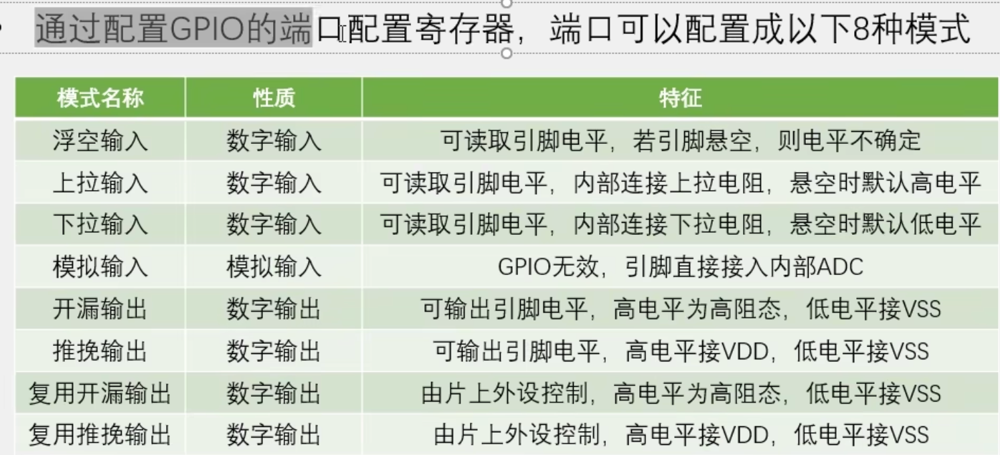

当要使用ADC的时候，引脚直接设置为模拟输入模式即可

单片机或者芯片，都使用了高电平弱驱动，低电平强驱动的规则，因此不能采用STM32连接LED的负极的方法

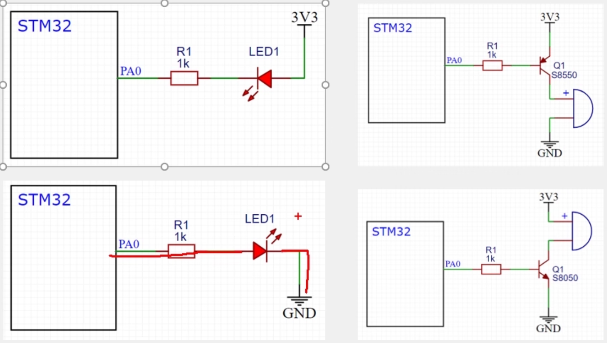

PNP的三级管最好与输入电源端（正极）相连

NPN的三极管与输出电源端（负极）相连


## 新建KeliSTM32工程

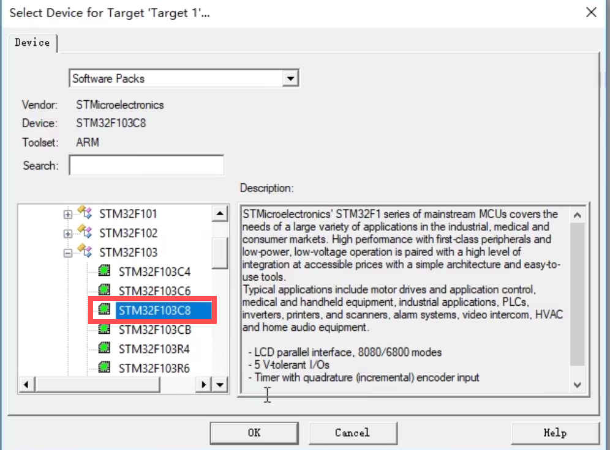

在工程文件中新建Start、Library、User三个文件夹用于导入库文件


在库中找到下面的文件

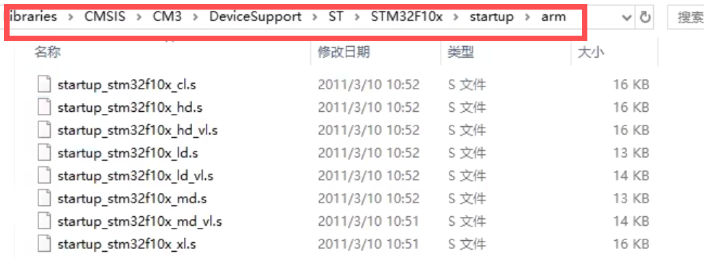

复制到Start文件夹下

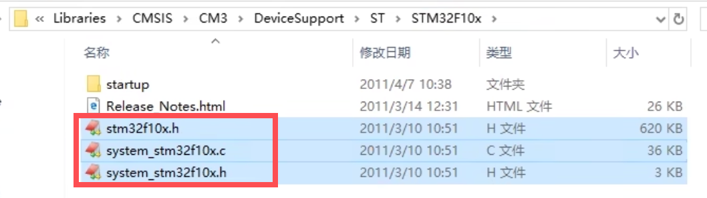

复制到start文件夹下

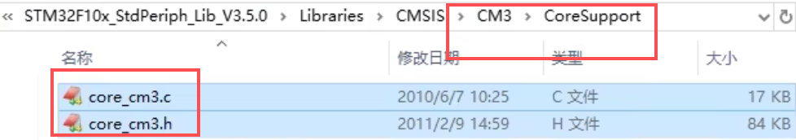

复制到start文件夹下

Start文件夹下的程序

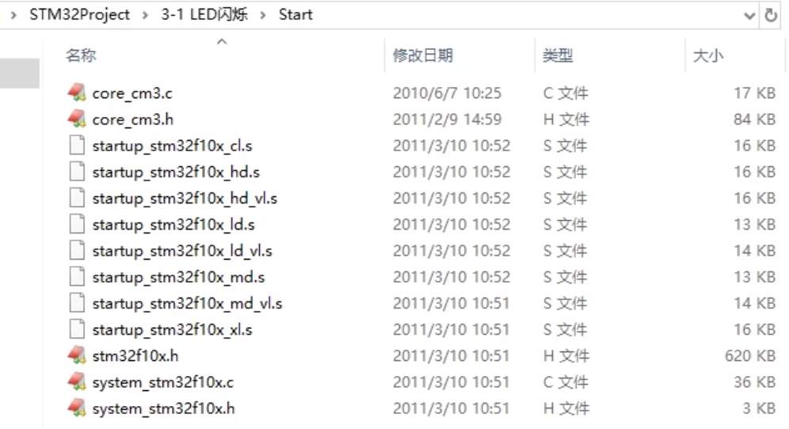


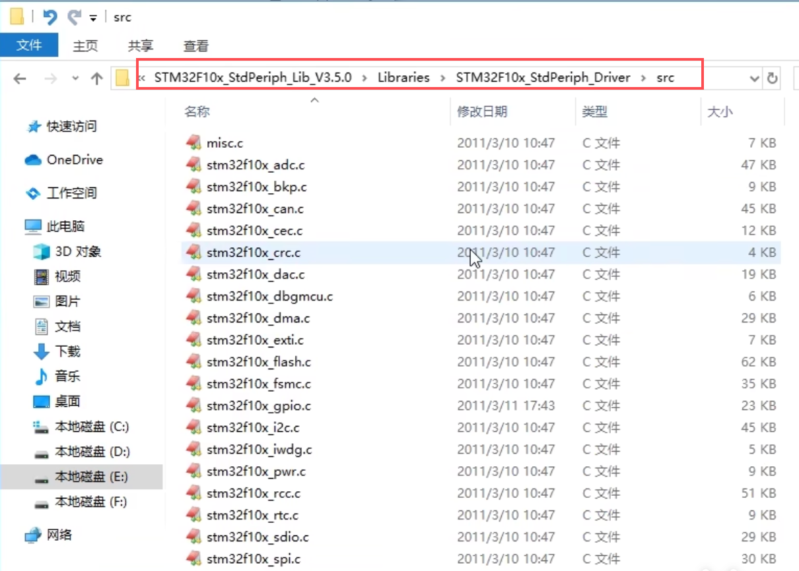

